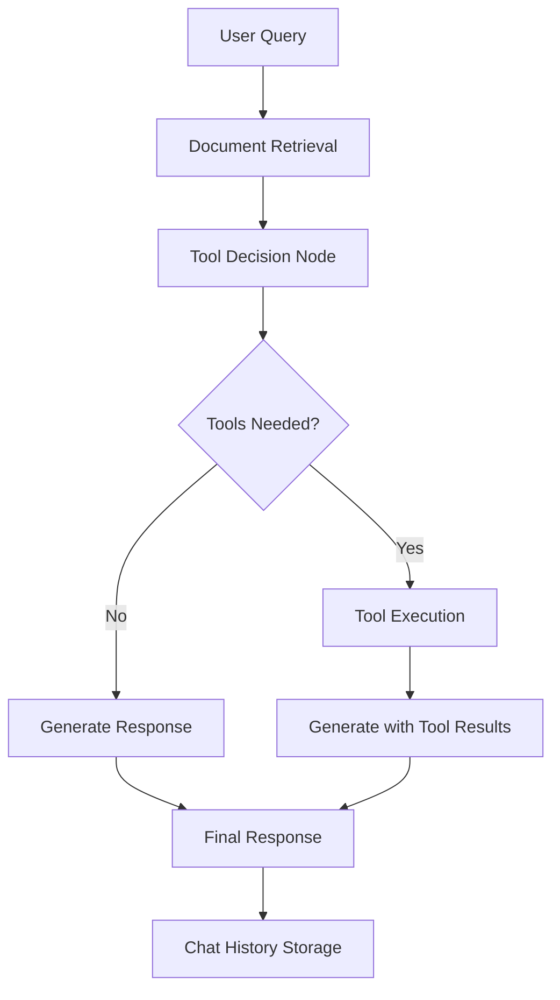

# RAG System with Tool Use - Architecture Guide

## 개요 (Overview)

이 문서는 Tool Use 기능이 추가된 RAG (Retrieval Augmented Generation) 시스템의 전체 아키텍처를 설명합니다.

## 시스템 아키텍처

### 전체 워크플로우



### 핵심 컴포넌트

#### 1. RAG System (`src/rag.js`)
메인 오케스트레이터로 전체 시스템을 관리합니다.

**주요 기능:**
- StateGraph 워크플로우 관리 (3가지 유형)
- 벡터 스토어 및 임베딩 관리
- 도구 시스템 통합
- 대화 히스토리 관리

**StateGraph 유형:**
1. **Basic Graph**: 단순 문서 Q&A
2. **Conversational Graph**: 대화 컨텍스트 지원
3. **Tool-Enabled Graph**: 도구 사용 지원

#### 2. Tool System (`src/tools/`)

##### BaseTool (`base-tool.js`)
모든 도구의 추상 기본 클래스입니다.

**기능:**
- 매개변수 검증
- 타임아웃 및 재시도 로직
- 안전한 실행 환경
- 결과 포맷팅

```javascript
class BaseTool {
  constructor(name, description, schema)
  async execute(params)           // 추상 메서드
  async safeExecute(params)       // 안전한 실행 래퍼
  validateParams(params)          // 매개변수 검증
  async isAvailable()             // 도구 가용성 확인
}
```

##### ToolRegistry (`tool-registry.js`)
도구 등록 및 관리 시스템입니다.

**기능:**
- 도구 등록/등록해제
- 카테고리별 관리
- 별칭 지원
- 검색 및 필터링

```javascript
class ToolRegistry {
  register(tool, category, aliases)
  get(nameOrAlias)
  getByCategory(category)
  search(query)
  async getAvailableTools()
}
```

##### ToolExecutor (`tool-executor.js`)
LLM 응답에서 도구 호출을 파싱하고 실행합니다.

**기능:**
- 다양한 패턴 인식
- 동시 실행 제한
- 실행 기록 관리
- 결과 포맷팅

**지원 패턴:**
1. `[TOOL:name:{"param":"value"}]`
2. `<tool name="name" params="..." />`
3. `USE_TOOL(name, {"param":"value"})`

#### 3. Built-in Tools (`src/tools/built-in/`)

##### Calculator Tool (`calculator.js`)
수학 계산을 수행하는 도구입니다.

**보안 기능:**
- 허용된 함수만 사용 (화이트리스트)
- 위험한 패턴 차단
- 입력 길이 제한
- 샌드박스 실행

**지원 함수:**
- 기본 사칙연산: `+`, `-`, `*`, `/`
- 수학 함수: `sqrt`, `sin`, `cos`, `tan`, `log` 등
- 유틸리티: `abs`, `max`, `min`, `round` 등

##### DateTime Tool (`datetime.js`)
날짜/시간 관련 작업을 수행하는 도구입니다.

**지원 작업:**
- `current`: 현재 날짜/시간 조회
- `format`: 날짜 포맷팅
- `add/subtract`: 날짜 계산
- `difference`: 날짜 차이 계산
- `parse`: 날짜 파싱

**시간대 지원:**
- 로컬 시간대
- UTC
- 주요 도시 시간대 (Asia/Seoul, America/New_York 등)

### 데이터 흐름

#### 1. 도구 지원 쿼리 처리

```
User Query
    ↓
Document Retrieval (벡터 검색)
    ↓
Tool Decision (LLM이 도구 필요성 판단)
    ↓
Tool Execution (필요시 도구 실행)
    ↓
Response Generation (문서 + 도구 결과로 답변 생성)
    ↓
Chat History Storage
```

#### 2. StateGraph 노드 구성

**Tool-Enabled Graph:**
1. `retrieve`: 문서 검색
2. `tool_decision`: 도구 필요성 판단
3. `tool_execution`: 도구 실행 (조건부)
4. `generate_with_tools`: 도구 결과 포함 답변 생성
5. `generate_no_tools`: 일반 답변 생성 (조건부)

### 보안 및 안전성

#### 도구 실행 보안
1. **입력 검증**: 스키마 기반 매개변수 검증
2. **허용 목록**: 안전한 함수만 허용
3. **패턴 차단**: 위험한 코드 패턴 차단
4. **타임아웃**: 무한 실행 방지
5. **샌드박스**: 격리된 실행 환경

#### 오류 처리
1. **재시도 로직**: 네트워크 오류 등에 대한 자동 재시도
2. **우아한 실패**: 도구 실행 실패 시 기본 RAG로 fallback
3. **오류 로깅**: 상세한 오류 정보 기록

### 성능 최적화

#### 동시 실행
- 최대 3개 도구 동시 실행
- 청크 단위 배치 처리
- 타임아웃 관리

#### 메모리 관리
- 실행 기록 크기 제한 (100개)
- 자동 정리 메커니즘
- 가비지 컬렉션 지원

#### 캐싱
- 도구 가용성 캐싱
- 벡터 스토어 메모리 캐싱
- 대화 히스토리 인메모리 저장

### 확장성

#### 새 도구 추가
1. `BaseTool` 상속 클래스 생성
2. `execute()` 메서드 구현
3. `ToolRegistry`에 등록

#### 새 StateGraph 패턴
1. 노드 함수 정의
2. 엣지 및 조건부 라우팅 설정
3. 그래프 컴파일 및 통합

#### 외부 API 통합
1. API 래퍼 도구 생성
2. 인증 및 오류 처리
3. 레이트 리미팅 구현

### 모니터링 및 디버깅

#### 로깅
- 도구 실행 로그
- 성능 메트릭
- 오류 추적

#### 통계
- 도구 사용 빈도
- 실행 시간 분석
- 성공률 모니터링

#### 디버깅 도구
- 실행 기록 조회
- 상태 정보 출력
- 테스트 스크립트

## 설계 원칙

### 1. 모듈성 (Modularity)
각 컴포넌트는 독립적으로 작동하며 쉽게 교체 가능합니다.

### 2. 보안 우선 (Security First)
모든 도구 실행은 보안 검증을 거쳐 안전하게 수행됩니다.

### 3. 우아한 실패 (Graceful Failure)
도구 실행 실패 시 기본 RAG 기능으로 fallback됩니다.

### 4. 확장성 (Extensibility)
새로운 도구와 기능을 쉽게 추가할 수 있는 구조입니다.

### 5. 성능 (Performance)
동시 실행, 캐싱, 메모리 관리를 통해 성능을 최적화합니다.

## 향후 개발 방향

### 단기 (1-2 주)
- Web Search 도구 추가
- File I/O 도구 개발
- 도구 체이닝 지원

### 중기 (1-2 개월)
- API 통합 도구 프레임워크
- 커스텀 도구 템플릿
- 비주얼 도구 편집기

### 장기 (3-6 개월)
- 멀티모달 도구 지원
- 분산 도구 실행
- 머신러닝 기반 도구 추천

이 아키텍처는 확장 가능하고 안전하며 성능이 우수한 Tool Use 시스템을 제공하여 RAG 시스템의 기능을 크게 향상시킵니다.